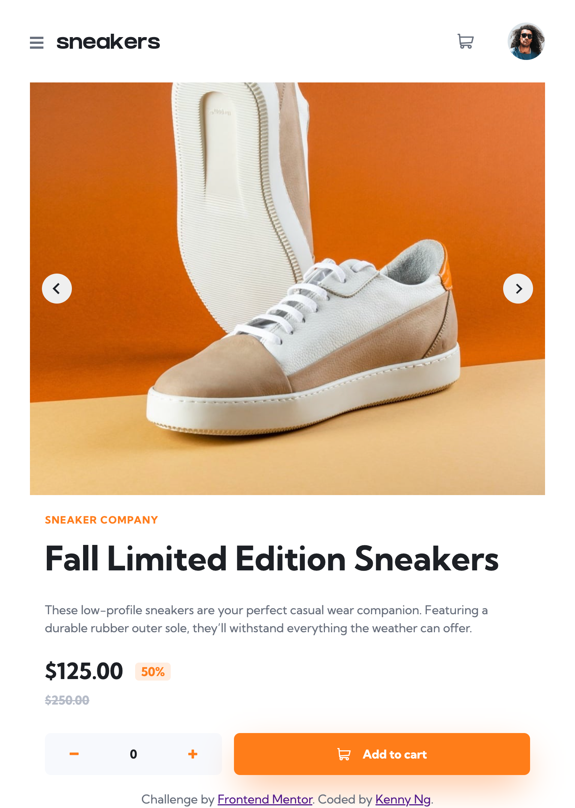

# Frontend Mentor - E-commerce product page solution

This is a solution to the [E-commerce product page challenge on Frontend Mentor](https://www.frontendmentor.io/challenges/ecommerce-product-page-UPsZ9MJp6). Frontend Mentor challenges help you improve your coding skills by building realistic projects.

## Table of contents

- [Overview](#overview)
  - [The challenge](#the-challenge)
  - [Screenshot](#screenshot)
  - [Links](#links)
- [My process](#my-process)
  - [Built with](#built-with)
  - [What I learned](#what-i-learned)
  - [Useful resources](#useful-resources)
- [Author](#author)

## Overview

### The challenge

Users should be able to:

- View the optimal layout for the site depending on their device's screen size
- See hover states for all interactive elements on the page
- Open a lightbox gallery by clicking on the large product image
- Switch the large product image by clicking on the small thumbnail images
- Add items to the cart
- View the cart and remove items from it

### Screenshot

Desktop version

Tablet version

Mobile version

### Links

- Solution URL: [https://www.frontendmentor.io/solutions/responsive-ecommerce-product-page-with-nextjs-lightbox-context-api-gq1E3CfTyy](https://www.frontendmentor.io/solutions/responsive-ecommerce-product-page-with-nextjs-lightbox-context-api-gq1E3CfTyy)
- Live Site URL: [https://fm-ecommerce-product-page-kennylun123.vercel.app/](https://fm-ecommerce-product-page-kennylun123.vercel.app/)

## My process

### Built with

- Semantic HTML5 markup
- CSS custom properties
- Flexbox
- CSS Grid
- [Next.js](https://nextjs.org/) - React framework
- CUBE CSS

### What I learned

- Server and Client Components
- Conditional rendering
- Context API (Cart provider)
- Lightbox
- Image Slider

### Useful resources

- [NextJS docs](https://nextjs.org/docs/getting-started/react-essentials) - This helped me for the concept of dividing the server and client side components.
- [How to use React Context with useState](https://medium.com/comsystoreply/how-to-use-react-context-with-usestate-c8ae4fe72fb9) - This is an amazing article which helped me finally understand React Context with practicle examples. I'd recommend it to anyone still learning this concept.

- [Simple React Image Slider](https://codesandbox.io/s/simple-react-image-slider-t68xrq?file=/src/slider.css) - This is a simple example that I built on CodeSandBox which helped to understand the idea of making a image slider.

## Author

- Website - [Kenny Ng](https://github.com/kennylun123?tab=repositories)
- Frontend Mentor - [@kennylun123](https://www.frontendmentor.io/profile/kennylun123)
- Twitter - [@kenny_ng123](https://www.twitter.com/kenny_ng123)

## Acknowledgments

- [E-Commerce Product Page in React + Lightbox Gallery + Cart](https://www.frontendmentor.io/solutions/-ecommerce-product-page-in-react-lightbox-gallery-cart-PxcEPSU-Sj) - Another great example of this challenge, I learned a lot from it. Big credits to [@visualdenniss](https://www.frontendmentor.io/profile/visualdenniss)
